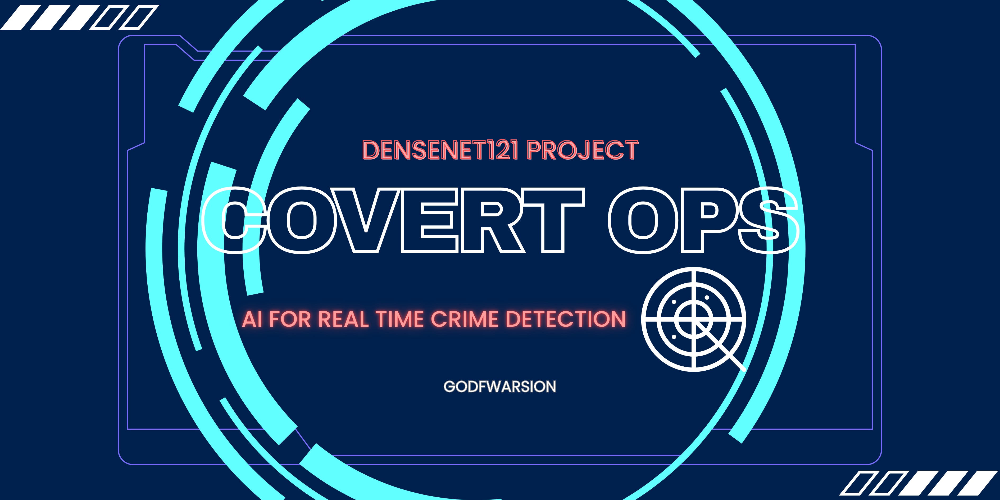

# Covert Ops: AI for Real-Time Crime Detection

[](LICENSE)
[](https://www.python.org/)
[](https://www.tensorflow.org/)
[](https://opencv.org/)




## 📌 Abstract

**Covert Ops** is an AI-powered surveillance system designed to enhance real-time crime detection capabilities. Using a DenseNet121 backbone with transfer learning, this project identifies and classifies suspicious or criminal incidents from video feeds. Activities such as arson, vandalism, traffic accidents, and fire are recognized via a robust model fine-tuned on crime-specific datasets.

## 🧠 Key Features

- 📹 Real-time video classification using CNN
- 🔍 Fine-tuned DenseNet121 model
- 🔄 Data preprocessing and augmentation
- 📊 Model testing and evaluation via Jupyter Notebooks
- 📁 Modular structure for reproducibility and scalability

## 🛠️ Tech Stack

- **Languages**: Python 3.8+
- **Libraries**: TensorFlow, Keras, OpenCV, NumPy, Matplotlib
- **Model**: DenseNet121 (with transfer learning)
- **Interface**: Jupyter Notebooks

## 🔧 Installation

### ✅ Prerequisites

- Python 3.8 or above
- pip
- virtualenv (optional but recommended)

### ⚙️ Setup

```bash
# Clone the repository
git clone https://github.com/GodFWarsion/Covert-Ops.git
cd Covert-Ops

# (Optional) Create a virtual environment
python -m venv venv
source venv/bin/activate  # On Windows use: venv\Scripts\activate

# Install dependencies
pip install -r requirements.txt
